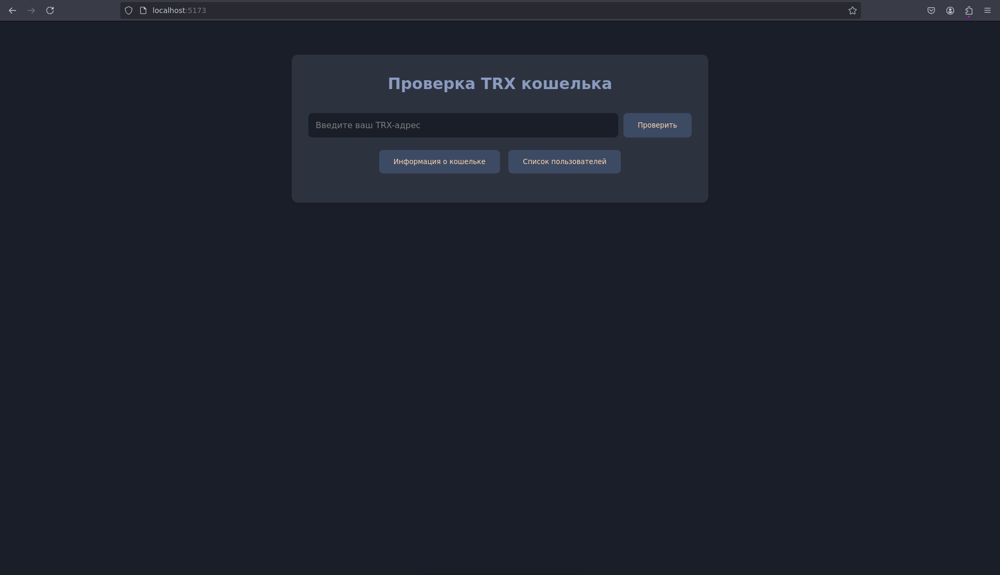
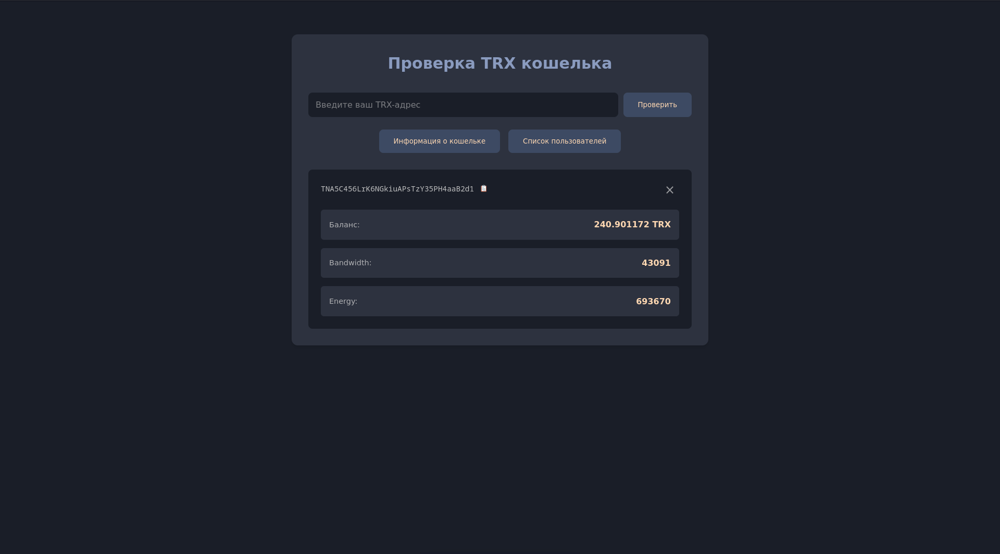
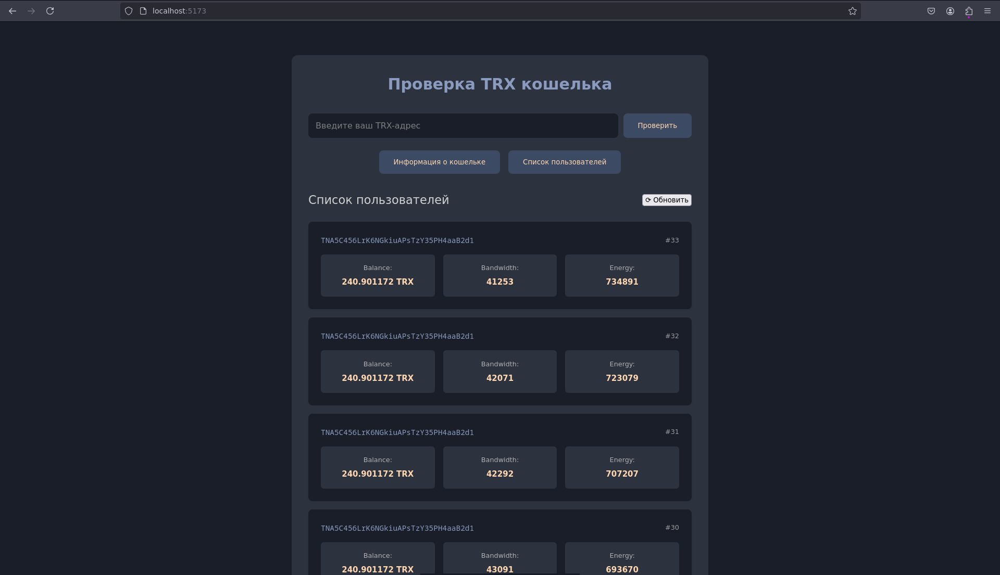

# Backend
## Установка
1. Перейдите в директорию с бекендом:
```bash
cd backend
```
2. Создайте виртуальную среду:
```bash
python3 -m venv trx
```
3. Активируйте среду:
```bash
source trx/bin/activate
```
```bash
trx\Scripts\activate
```
4. Установите нужные библиотеки:
```bash
pip install -r requirements.txt
```
5. Перейдите в TrxChecker
```bash
cd ../
```
5. Запустите бекенд сервер:
```bash
uvicorn backend.app.main:app --reload
```
5.1 Добавьте токен в .env (получить на сайте [TronGrid Dashboard]https://www.trongrid.io/)


# Frontend Service
## Установка
1. Перейдите в директорию с фронтендом:
```bash
cd frontend/vue-project
```
2. Убедитесь, что у вас установлен Node.js и npm.
3. Установите зависимости, выполнив команду:
```bash
npm install
```
## Запуск
Запустите фронтенд сервис, используя команду:
```bash
npm run dev
```


# PostgreSQL
## Создание контейнера с использованием Docker Compose

1. Убедитесь, что у вас установлены Docker и Docker Compose.
   Проверьте установку:
   ```bash
   docker --version
   docker-compose --version
   ```

2. Перейдите в директорию проекта:
   ```bash
   cd backend/database
   ```

3. Запустите контейнеры:
   Выполните команду:
   ```bash
   sudo docker-compose up -d
   ```

4. Проверьте статус контейнеров:
   Убедитесь, что контейнеры запущены:
   ```bash
   sudo docker-compose ps
   ```

5. Остановка контейнера
    ```bash
    sudo docker-compose down
    ```


# Tests
## Запуск тестов
1. Перейдите в корневую папку:
```bash
cd TrxChecker
```
2. Запустить тесты
```bash
pytest backend/tests/test_api.py -v
```


## Превью




---